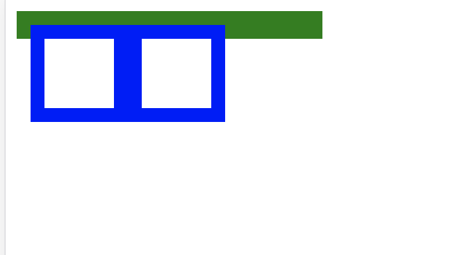

## 前端面试题

HTML/CSS/JavaScript/HTTP 协议相关
HTML由于太过简单,将其整合到JavaScript和css中来询问

### 首先是 JavaScript 相关

Q:给定一个字符串,将字符串顺序/逆序加上空格打印出来(初级)

A:
``` javascript
    function spacify(str) {
        console.log(str.split('').join(' ')) //顺序打印
        console.log(Array.prototype.slice.call(str).reverse().join(' ')) //逆序打印
        console.log(Array.from(str).reverse().join(' ')) //逆序打印es6
    }
    spacify('abcde')
```
Q:给定一个或**多个**字符串,将字符串顺序/逆序加上空格打印出来(中级)

A:
``` javascript
function spacify() {
    // arguments是伪数组 先要变成数组 可以用es5或者es6(加分)
    // strs可能是多个元素['123','abc']
    // const strs = Array.prototype.slice.call(arguments).join('')
    const strs = Array.from(arguments).join('')
    console.log(strs.split('').join(' ')) //顺序打印
    console.log(strs.split('').reverse().join(' ')) //逆序打印
}
spacify('abcde','fgh')
```
Q:给定一个或多个字符串,将字符串去重后顺序/逆序加上空格打印出来(高级)

A:
``` javascript
function spaceify() {
    // 可以使用多种方式进行去重 比如reduce/for循环/filter/对象属性等多种方法,其中使用es6的代码为最简(加分)
    const strs = [...new Set(Array.from(arguments).join(''))].join('')
    console.log(strs.split('').join(' ')) //顺序打印
    console.log(strs.split('').reverse().join(' ')) //逆序打印
}
spaceify('abhgcd23e')

```
Q:给定一个对象,包含country,name,age三个属性,要求实现一个方法,可以在**不修改原对象**的情况下,替换其中的name和age属性,返回一个新对象.
```JavaScript
 {                              {
     country: 'China',              country: 'China',
     name: 'lilei',        =>       name: 'hanmeimei',
     age: 22                        age: 24
 }                              }
```

A: 
``` javascript
const defaultUser = {
    country: 'China',
    name: 'lilei',
    age: 22
}
function changePrototype(defaultUser, name, age) {
    return {
        ...defaultUser,
        name: name,
        age: age
    }
}
const anotherUser = changePrototype(defaultUser, 'hanmeimei', 24)
console.log(defaultUser)
console.log(anotherUser)
```
Q: 现有一串JSON数据,要求根据数据生成对应的DOM插入文档中id为station的ul节点中.(使用原生JavaScript方法)(初级)
``` javascript
    var data = [
        {
            location: '江苏省无锡市滨湖区',
        },
        {
            location: '江苏省苏州市虎丘区',
        },
        {
            location: '上海市静安区',
        }
    ]
```
A: 
``` JavaScript
<ul id="station"></ul>
<script>
    const data = [{
            location: '江苏省无锡市滨湖区',
        },
        {
            location: '江苏省苏州市虎丘区',
        },
        {
            location: '上海市静安区',
        }
    ]
    const ul = document.getElementById('station')
    function render(list) {
        let a;
        for (let i = 0; i < list.length; i++) {
            a = document.createElement('li')
            a.appendChild(document.createTextNode(list[i].location))
            ul.appendChild(a)
        }
    }
    render(data)
</script>
```

Q: 现有一串JSON数据,要求根据数据生成对应的DOM插入文档中id为station的ul节点中,并且在点击对应生成的DOM节点中会弹出该节点的序号.(使用原生JavaScript方法)(中级)
``` javascript
var data = [
    {
        location: '江苏省无锡市滨湖区',
    },
    {
        location: '江苏省苏州市虎丘区',
    },
    {
        location: '上海市静安区',
    }
]
```

A: 
``` JavaScript
var data = [
    {
        location: '江苏省无锡市滨湖区',
    },
    {
        location: '江苏省苏州市虎丘区',
    },
    {
        location: '上海市静安区',
    }
]
// 较差解法,如果有大量数据存在,对每一个元素绑定addEventListener会占用大量内存
const ul = document.getElementById('station')
function render(list) {
    let a;
    for (let i = 0; i < list.length; i++) {
        a = document.createElement('li')
        a.appendChild(document.createTextNode(list[i].location))
        a.addEventListener('click', function() {
            alert(i)
        })
        ul.appendChild(a)
    }
}
// 一般解法,考虑到了使用事件代理来解决,但并未考虑到性能优化的问题
const ul = document.getElementById('station')
ul.addEventListener('click', function (e) {
    if (e.target && e.target.nodeName.toUpperCase() === 'LI') {
        console.log(e.target.dataset.index)
    }
})

function render(list) {
    let a;
    for (let i = 0; i < list.length; i++) {
        a = document.createElement('li')
        a.dataset.index = i
        a.appendChild(document.createTextNode(list[i].location))
        ul.appendChild(a)
    }
}
render(data)
// 优秀的解法,使用documentFragment来解决大量DOM插入的时候引起的reflow和reprint,明白优化性能
const ul = document.getElementById('station')
const df = ducment.createDocumentFragment()
ul.addEventListener('click', function (e) {
    if (e.target && e.target.nodeName.toUpperCase() === 'LI') {
        console.log(e.target.dataset.index)
    }
})

function render(list) {
    let a;
    for (let i = 0; i < list.length; i++) {
        a = document.createElement('li')
        a.dataset.index = i
        a.appendChild(document.createTextNode(list[i].location))
        df.appendChild(a)
    }
    ul.appendChild(df)
}
render(data)
```
考察css相关

Q:给定一个子元素,不知道它的宽高,要求实现在父元素中水平和垂直方向均居中,写出实现过程,越多越好
(父元素有宽高)
``` html
<div id="app">
	<p>水平垂直居中的任意元素</p>
</div>
```

A: 

1:利用table中单元格因默认就是 vertical-align:middle 的特性来实现
``` css
#app{
	height:100px;
	text-align:center;
}
#app:after{
	display:inline-block;
	width:0;
	height:100%;
	vertical-align:middle;
	content:'';
}
#app p{
	display:inline-block;
	vertical-align:middle;
}
```
2: 利用vertical-align只会作用于inline元素和table-cell元素的特性以及 vertical-align 的对齐就基于每个 line box（行框)
但有一个问题,就是当行框的内容超出一行以后,水平居中就失效了,因为它们将不再处于同一line box.
```css
#app{
	height:100px;
	text-align:center;
}
#app:after{
	display:inline-block;
	width:0;
	height:100%;
	vertical-align:middle;
	content:'';
}
#app p{
	display:inline-block;
	vertical-align:middle;
}
```
3:  HTML 中的换行符、空格符、制表符等产生了空白符，而这些归根结底都是字符，那么它们的大小都是受 font-size 来控制的，字体大小直接导致 inline 或者 inline-block 后元素之间空隙的大小，把 inline-block 元素间的空隙认为总是某个固定大小是错误的。所以当 font-size:0 的时候元素间的空隙都为0了
```css
#app{
	height:100px;
	text-align:center;
	font-size:0;
}
#app:after{
	display:inline-block;
	width:0;
	height:100%;
	vertical-align:middle;
    content:'';
}
#app p{
	display:inline-block;
	vertical-align:middle;
	font-size:16px;
}
```
4.使用flex
```css
#app {
    display: flex;
    justify-content: center; /* 水平居中 */
    align-items: center; /*垂直居中*/
}
```
5.absolute+transform

```css
#app {
    position: relative;
    height: 300px;
    width: 100%;
}

p {
    position: absolute;
    left: 50%;
    top: 50%;
    transform: translate(-50%, -50%);
}
```
6.grid
```css
#app {
    display: grid;
    width: 300px;
    height: 300px;
}
p {
    margin: auto;
}
```
7.box-alig+box-pack

```css
#app{
    position: relative;
    top: 0; left: 0; right: 0; bottom: 0;
    display: -webkit-box;
    -webkit-box-align: center;
    -webkit-box-pack: center;
}
p{
    -webkit-box-flex: 0;
}
```

Q:如下是一个HTML片段
```html
 <body>
    <div class="a">
        <div class="b"></div>
        <div class="b"></div>
    </div>
</body>
<style>
    .a {
        border: 10px solid green;
        width: 200px;
    }

    .b {
        border: 10px solid blue;
        width: 50px;
        height: 50px;
        float: left;
    }

</style>
```
我们期待的结果是

但实际的结果是


请添加最少的**css**代码来实现期待的结果

A: 
```css
.a {
    border: 10px solid green;
    width: 200px;
    overflow: hidden; //运用BFC来解决浮动导致的高度塌陷(能答出BFC的为优秀)
}
```
实现BFC的方法如下

- float属性不为none
- position为absolute或fixed
- display为inline-block, table-cell, table-caption, flex, inline-flex
- overflow不为visible

### HTTP相关
Q: 如果我们的接口地址是api.34580.com,静态资源地址是static.34580.com,而我们的项目地址是wx.34580.com,在服务端和客户端没有做任何设置的情况下,我在项目地址当中使用ajax请求接口地址会发生什么?,加载静态资源的时候会发生什么?如果我们业务中同时包含有有**提交表单**的操作,有什么方法可以解决?请简述解决的流程.

A:

当一个资源从与该资源本身所在的服务器不同的域或端口请求一个资源时，资源会发起一个跨域 HTTP 请求。
比如，站点 http://domain-a.com 的某 HTML 页面通过  的 src 请求 http://domain-b.com/image.jpg。
网络上的许多页面都会加载来自不同域的CSS样式表，图像和脚本等资源。
 
出于安全原因，浏览器限制从**脚本内发起的跨源HTTP请求**。 例如，XMLHttpRequest和Fetch API遵循同源策略。 这意味着使用这些API的Web应用程序只能从加载应用程序的同一个域请求HTTP资源，除非使用CORS头文件。

跨域资源共享标准新增了一组 HTTP 首部字段，允许服务器声明哪些源站有权限访问哪些资源。另外，规范要求，对那些可能对服务器数据产生副作用的 HTTP 请求方法（特别是 GET 以外的 HTTP 请求，或者搭配某些 MIME 类型的 POST 请求），浏览器必须首先使用 OPTIONS 方法发起一个预检请求（preflight request），从而获知服务端是否允许该跨域请求。服务器确认允许之后，才发起实际的 HTTP 请求。在预检请求的返回中，服务器端也可以通知客户端，是否需要携带身份凭证（包括 Cookies 和 HTTP 认证相关数据）。